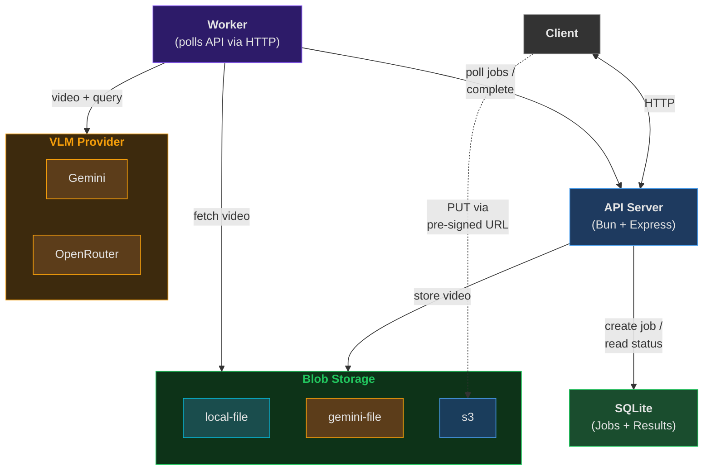

# VLM Video Q&A API

A backend API that lets users query videos using a VLM (Vision Language Model) with natural language Q&A. Submit a video, ask questions about it, and get answers powered by a model-agnostic VLM provider.

## Architecture



### Components

| Component | Role |
|---|---|
| **API Server** (Bun + Express) | Receives requests, stores videos, creates jobs, validates videos against the VLM provider, returns results |
| **Database** (SQLite) | Stores video metadata (including storage type and ref) and job state (`pending` → `processing` → `completed`). Also acts as the job queue |
| **Storage Registry** | Routes video storage per-type. Each video tracks its own `storageType` and `storageRef` |
| local-file | Stores video bytes on the local filesystem |
| gemini-file | Uploads video to Gemini's File API for large files that exceed the inline threshold |
| s3 | Stores video in S3 via pre-signed URLs — client uploads directly to S3, bypassing the API server |
| **Worker** | Polls the API for pending jobs, fetches video data from the Storage Registry, calls the VLM, and writes results back via the API |
| **VLM Registry** | Routes queries to the right provider based on the model string in the request |
| Gemini | VLM provider for `gemini-*` models. Validates that videos fit inline or use gemini-file storage |
| OpenRouter | VLM provider for `provider/model` style IDs (e.g. `google/gemini-2.5-flash`). Accepts any locally-stored video; rejects gemini-file URIs |

### Processing Model

1. Client uploads a video with an optional `storageType` → API Server stores it via the matching Storage Registry backend and records the metadata in the Database. For S3, the server returns a pre-signed URL and the client uploads the file directly to S3 (dashed line in diagram)
2. Client submits a query with a model name → API Server finds the VLM provider, calls `validateVideo` to check the video is compatible (e.g. size vs. inline threshold), and creates a `pending` job record. Returns 422 if validation fails
3. Worker claims a pending job via the API, looks up the video metadata, fetches the video data from the Storage Registry, sends it with the query to the VLM provider, and writes the result back via the API
4. Client polls the API Server with the job ID → API Server reads the result from the Database and returns it

## Design Decisions

**Async job processing** — Videos can be anywhere from 10 seconds to hours long. Instead of holding HTTP connections open (and timing out on long videos), jobs are queued and processed asynchronously. Client polls for results.

**Model-agnostic architecture** — The VLM space moves fast. Built a registry pattern so you can swap between Gemini, OpenRouter, or add new providers without touching core logic.

**Pluggable storage** — Same idea for storage. Local filesystem for dev, Gemini File API for large files, or S3 for production — all via the same interface.

**Worker queue pattern** — Designed around an interview constraint where "VLM boxes can only handle one request at a time." Even though that's not a real limitation with modern APIs, the pattern works well for: retry logic, horizontal scaling (add more workers), and clean separation between API and processing.

## Constraints

- **Variable video length** — Processing time depends on video duration. Async prevents timeouts.
- **Multiple VLM providers** — Different models have different strengths, pricing, and limits. Registry routes to the right one.
- **Storage flexibility** — Small videos stay local; large ones go to Gemini File API or S3.
- **Worker pattern** — Originally designed for "one request at a time" limitation (interview scenario). Kept because it handles failures gracefully and lets you scale workers independently from the API.
- **Job claim concurrency** — The `POST /jobs/claim` endpoint must handle multiple workers atomically to prevent race conditions and duplicate work. SQLite transactions ensure only one worker gets each job.

## API

### Videos
- `POST /videos` — Upload a video (multipart form or JSON for S3), returns video ID
- `GET /videos/:id` — Get video metadata
- `PATCH /videos/:id` — Update storage reference (e.g., confirm S3 upload)
- `DELETE /videos/:id` — Delete video and associated file

### Jobs
- `POST /jobs` — Create a query job (`videoId`, `query`, `model`), returns job ID
- `GET /jobs/:id` — Get job status and result
- `POST /jobs/claim` — Worker claims next pending job (atomic, handles multiple workers)
- `PATCH /jobs/:id` — Worker writes result (completed/failed)

## Future Ideas

**Index Processing** — Pre-process videos to build searchable indexes:
- Group frames by visual similarity using embeddings
- Use cheaper VLMs to generate descriptions for frame groups
- Cluster similar scenes with K-means
- Store in vector DB for RAG-style queries

**Agentic Tooling** — Let the VLM use tools (calculators, search, etc.) to answer questions

**Load Balancing** — Smart routing across a cluster of VLM boxes based on queue depth and latency

## Getting Started

```bash
bun install
```

Copy `.env.example` to `.env` and adjust values if needed, then start both processes:

```bash
# API server
bun run src/index.ts

# Worker (separate terminal)
bun run src/worker.ts
```

## Tech Stack

- **Runtime**: Bun
- **Framework**: Express
- **Database**: SQLite (via `bun:sqlite`)
- **VLM**: Gemini, OpenRouter (pluggable via VLM Registry)
- **Storage**: Local filesystem, Gemini File API, S3 (pluggable via Storage Registry)
