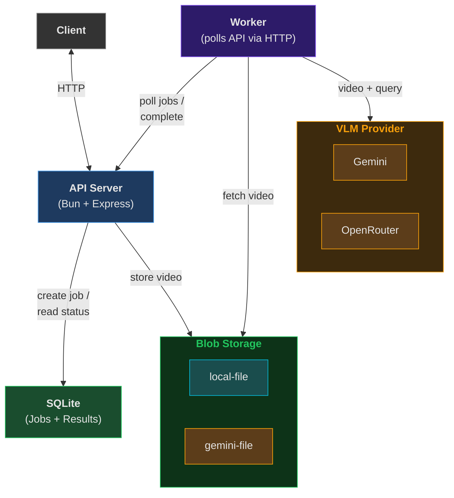

# VLM Video Q&A API

A backend API that lets users query videos using a VLM (Vision Language Model) with natural language Q&A. Submit a video, ask questions about it, and get answers powered by a model-agnostic VLM provider.

## Architecture



### Components

| Component | Role |
|---|---|
| **API Server** (Bun + Express) | Receives requests, stores videos, creates jobs, validates videos against the VLM provider, returns results |
| **Database** (SQLite) | Stores video metadata (including storage type and ref) and job state (`pending` → `processing` → `completed`). Also acts as the job queue |
| **Storage Registry** | Routes video storage per-type. Each video tracks its own `storageType` and `storageRef` |
| local-file | Stores video bytes on the local filesystem |
| gemini-file | Uploads video to Gemini's File API for large files that exceed the inline threshold |
| **Worker** | Polls the API for pending jobs, fetches video data from the Storage Registry, calls the VLM, and writes results back via the API |
| **VLM Registry** | Routes queries to the right provider based on the model string in the request |
| Gemini | VLM provider for `gemini-*` models. Validates that videos fit inline or use gemini-file storage |
| OpenRouter | VLM provider for `provider/model` style IDs (e.g. `google/gemini-2.5-flash`). Accepts any locally-stored video; rejects gemini-file URIs |

### Processing Model

1. Client uploads a video with an optional `storageType` → API Server stores it via the matching Storage Registry backend and records the metadata in the Database
2. Client submits a query with a model name → API Server finds the VLM provider, calls `validateVideo` to check the video is compatible (e.g. size vs. inline threshold), and creates a `pending` job record. Returns 422 if validation fails
3. Worker claims a pending job via the API, looks up the video metadata, fetches the video data from the Storage Registry, sends it with the query to the VLM provider, and writes the result back via the API
4. Client polls the API Server with the job ID → API Server reads the result from the Database and returns it

## Getting Started

```bash
bun install
```

Copy `.env.example` to `.env` and adjust values if needed, then start both processes:

```bash
# API server
bun run src/index.ts

# Worker (separate terminal)
bun run src/worker.ts
```

## Tech Stack

- **Runtime**: Bun
- **Framework**: Express
- **Database**: SQLite (via `bun:sqlite`)
- **VLM**: Gemini, OpenRouter (pluggable via VLM Registry)
- **Storage**: Local filesystem, Gemini File API (pluggable via Storage Registry)
